## Sobre
Sistema de Divulgação de vagas, Triagem de candidatos(Análise de Currículo, Teste Comportamental, Teste Prático e Entrevista) com disparo de e-mail para cada fase da triagem. 

## Rodando o projeto
Após baixar o projeto é necessário realizar algumas etapas.
<ul>
    <li>Instalando dependências: Rode o comando "composer install" no terminal dentro do projeto. </li>
    <li>Utilize o comando "php artisan serve" para iniciar o servidor. </li>
    <li><strong>Importante</strong>Utilize o comando "php artisan migrate" para que os as tabelas sejam inseridas no banco de dados.</li>
</ul>
    
## Funcionalidades
Site:
<ul>
    <li>Página inicial com informações da empresa contratante e listagem de vagas.</li>
    <li>Página com informações da vaga selecionada.</li>
    <li>Página de candidatura do aluno à vaga selecionada.</li>
</ul>

Admin:
<ul>
    <li>Página de cadastro de usuário Admin.</li>
    <li>Página de login.</li>
    <li>Página de Criação de vagas.</li>
    <li>Página de Listagem de vagas.</li>
    <li>Página de Edição de vagas.</li>
    <li>Página de Listagem de Candidatos.</li>
    <li>Página de Informações de um candidato específico.</li>
    <li>Download de currículo de candidatos.</li>
    <li>Página de Triagem de candidatos de uma vaga.</li>
    <li>Exclusão de vagas.</li>
    <li>Exclusão e eliminação de candidatos.</li>
</ul>
Geral:
<ul>
    <li>Envio de e-mails em todas as fases da triagem.</li>
</ul>

## Imagens do sistema:
    Site:

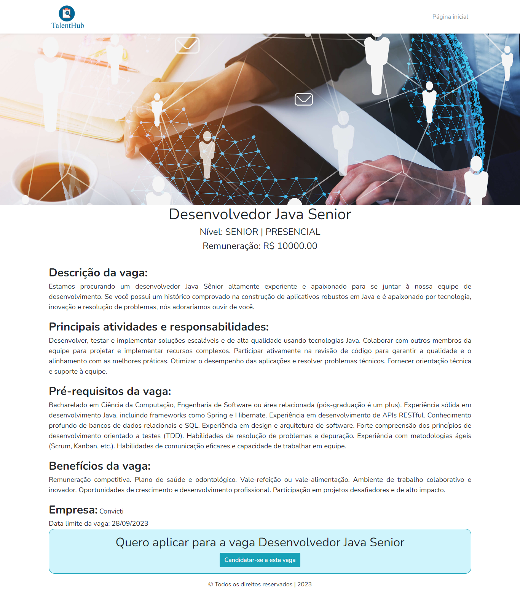
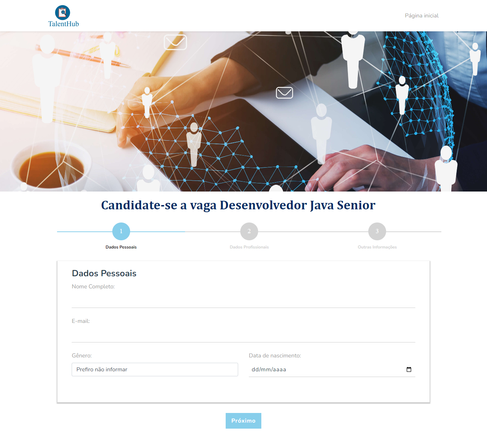
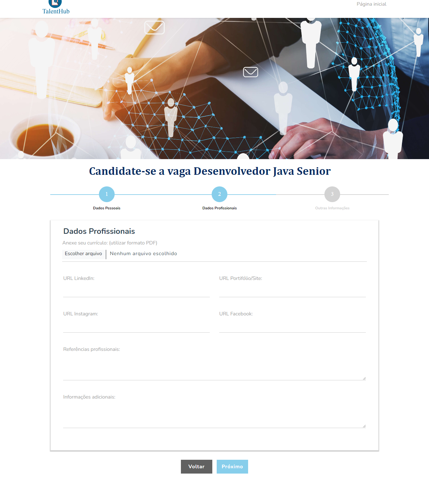
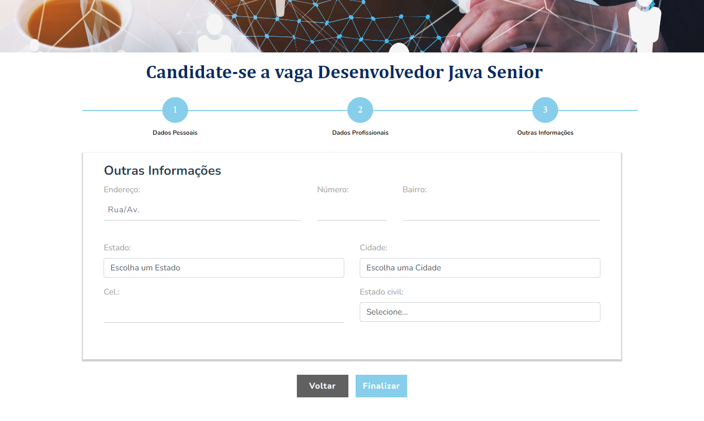
    
    Login:
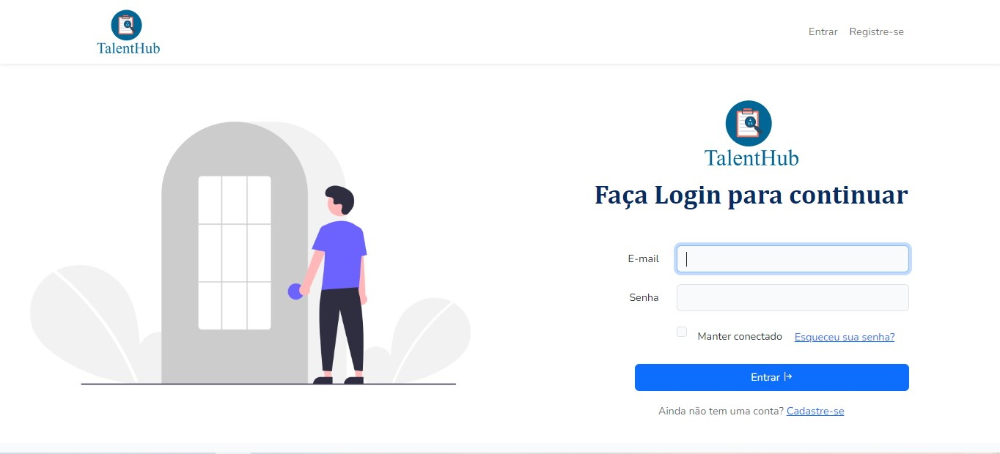
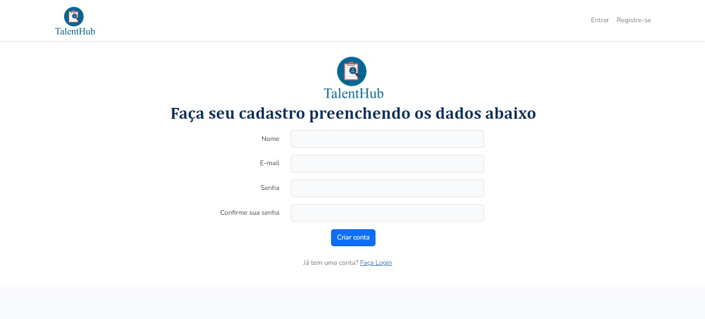

    Admin:
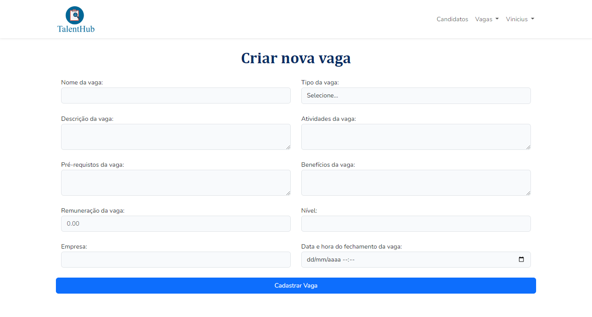
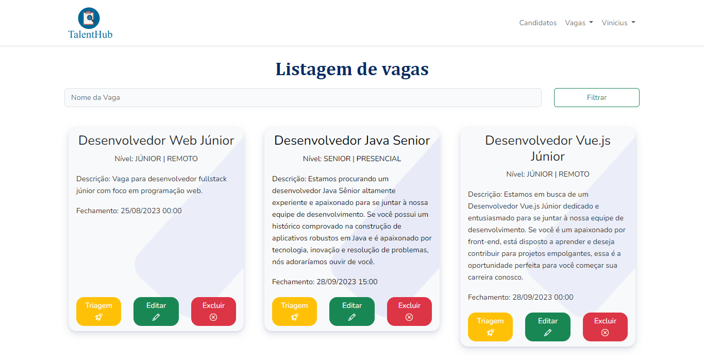
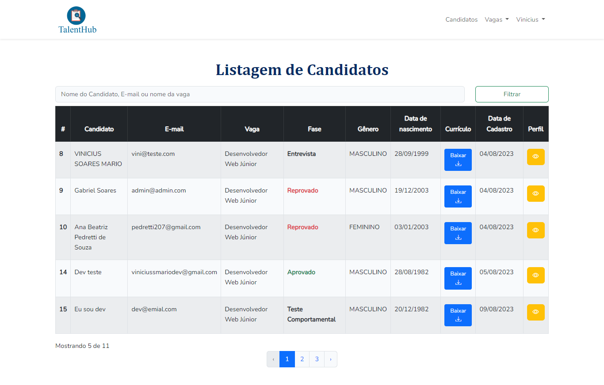
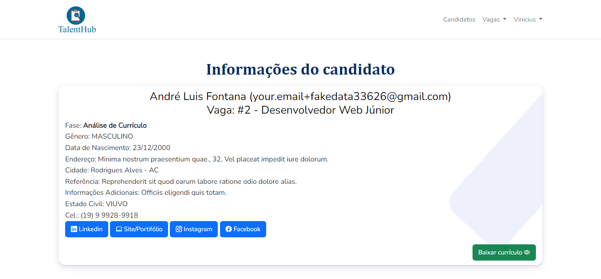
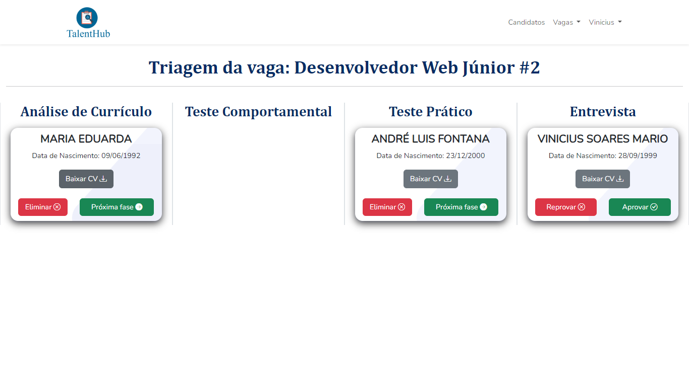
